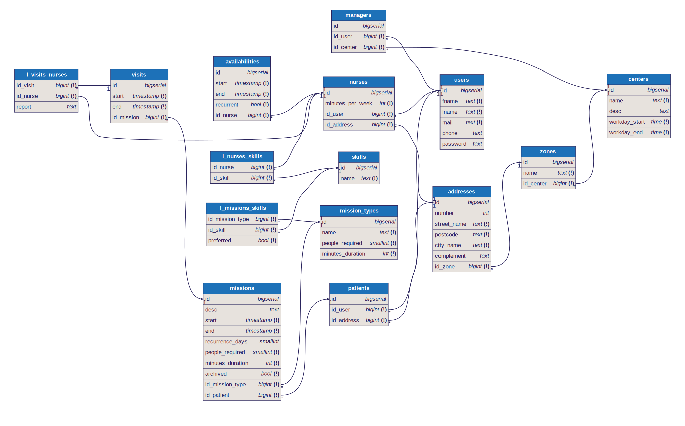

# Database

## Database diagram

The DB diagram was written in DBML ([Download dbml file](_media/db.dbml ':ignore')) and was automatically transpiled in PostgreSQL.



If you want to change the database we recommend you to use the same tool stack. Firstly, [Download the dbml file](_media/db.dbml ':ignore') and import it inside [dbdiagram.io](https://dbdiagram.io/) website and modify it as you wish. Secondly, when you finished, export the new dbml file and transpile it in your favorite SQL database engine using [transpiler tool](https://dbml.dbdiagram.io/cli/#installation). Lastly, if you want a well-designed db diagram from your dbml as above, you can use [dbml renderer tool](https://github.com/softwaretechnik-berlin/dbml-renderer)

## Data

Here is a partial dump of the database with test data: [dump.sql](_media/dump.sql ':ignore').

You can download it and insert it in the database using the following command:

```sh
curl https://ta72-project.github.io/documentation/_media/dump.sql | docker exec -i backend-database-1 psql -f -
```

If you need to dump the database to a file, you can use the following command:

```sh
docker exec backend-database-1 pg_dump -a --column-inserts -T "__*" | grep -E "(INSERT|SELECT)" > dump.sql
```
